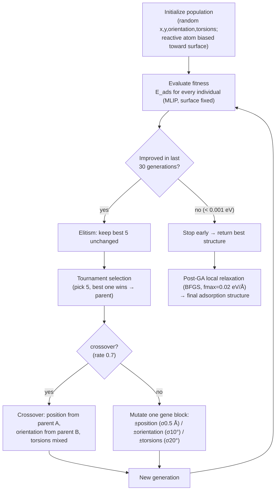

# How GOAD finds the lowest-energy structure

*And why a genetic algorithm solves a different problem than a DFT geometry
optimization.*

This note explains the search strategy behind the GOAD + SevenNet structures in
this benchmark: what GOAD actually optimizes, how the genetic algorithm (GA)
converges on the lowest-energy adsorption geometry, and how that differs from a
DFT relaxation that "rolls downhill" on the potential-energy surface (PES). It is
grounded in the engine code (`goad_v1/ga/genetic_algorithm.py`); see
[`GOAD_ENGINE.md`](GOAD_ENGINE.md) for the application itself.

---

## 1. The problem: one PES, many valleys

Put a molecule near a surface and its energy `E` is a function of **all** the
atomic coordinates. That function is the **potential-energy surface (PES)**. For
an adsorbate it is not a simple bowl — it is a rugged landscape with *many*
minima, because the molecule can sit at different **sites** (atop / bridge /
hollow), in different **orientations**, and in different **conformations**
(rotations about its own bonds):

```
 E
 │   \          /\            /\
 │    \        /  \    /\    /  \        <- each valley = one locally stable
 │     \  /\  /    \  /  \  /    \          adsorption geometry (a local minimum)
 │      \/  \/      \/    \/      \___
 │                        ^
 │                        └── global minimum = the structure we actually want
 └──────────────────────────────────────────► configuration (site, orientation, torsion…)
```

The **global minimum** is the physically correct, most stable structure. The
central difficulty is that the valleys are separated by **energy barriers**: you
cannot reach the deepest valley from a random starting point just by going
downhill, because a downhill path stops at the bottom of whatever valley you
happen to start in.

---

## 2. What GOAD optimizes: a compact "genome", not raw coordinates

GOAD does **not** search all `3N` Cartesian coordinates. It fixes the surface and
treats the molecule as a semi-rigid body, encoding each candidate placement as a
short list of numbers — the **genome** (`_initialize_population`):

| Genes | Count | Meaning |
|---|---|---|
| **Position** | 3 | molecule centre-of-mass `(x, y, z)` — where on the surface, and how high |
| **Orientation** | 3 | ZYX Euler angles `(α, β, γ)` — how the molecule is tilted/rotated |
| **Torsions** | `N` | one dihedral angle per **rotatable bond** (RDKit: single, acyclic, non-terminal bonds), so flexible molecules can change conformation |

So a butanol placement is ~9 numbers, not ~45 Cartesian coordinates. This small,
chemically meaningful search space is what makes a **global** search affordable.

Two design choices make generation 0 sensible instead of random:

- **Chemically-biased height.** The reactive atom is seeded near its known bond
  distance — lowest **O** at ~2.3 Å above the surface, else lowest **C** at
  ~2.1 Å — so every first-generation candidate already feels a real
  surface interaction instead of floating in vacuum.
- **Order matters:** each candidate is built as *apply torsions → centre → rotate
  → translate to `(x,y,z)`*, keeping the reactive atom pointing at the surface.

### Fitness = adsorption energy from a fast MLIP

Each candidate is scored by its **adsorption energy**
(`_evaluate_individual_worker`):

```
E_ads = E(surface + molecule) − E(surface) − E(molecule)
```

evaluated as a **single-point** energy (no relaxation) with the surface atoms
**fixed** (`FixAtoms`). The energy comes not from DFT but from a machine-learning
interatomic potential (MLIP) — **SevenNet-OMNI** in this benchmark (the engine
also supports MatterSim / CHGNet / MACE via `calculator_manager.py`). A single
MLIP energy is milliseconds-to-seconds; a single DFT energy is minutes-to-hours.
That speed is what lets GOAD evaluate **thousands** of candidates.

Lower `E_ads` = fitter.

---

## 3. The genetic algorithm loop

The GA maintains a **population** of placements (default 30) and improves them
over **generations** (up to 200) by mimicking natural selection
(`run` → `_selection_crossover_mutation`):



The operators are what make this a **global** search rather than a downhill walk:

- **Tournament selection** (size 5) + **elitism** (top 5 always survive): good
  placements preferentially become parents, so the population drifts toward low
  energy — *exploitation*.
- **Crossover** recombines *parts* of two good solutions (site of one, orientation
  of another, a mix of torsions). This can jump straight into a new valley that
  neither parent occupied — something a downhill optimizer can never do.
- **Mutation** applies random Gaussian nudges to position, orientation, **or**
  torsions (each ~⅓ of the time), with height clamped to the interaction window.
  This keeps *exploring* nearby and occasionally hops over a barrier.
- **Early stopping**: if the best energy hasn't improved by > 0.001 eV in 30
  generations, the search is considered converged.

The result of the GA is the best **genome** — i.e. the right **basin** of the PES
(the correct site + orientation + conformation).

### The crucial second stage: local relaxation

The GA scores candidates *rigidly* (single-point, surface fixed) to stay cheap,
so its winner has the right shape but not the exact minimum-energy coordinates.
GOAD then runs a **local BFGS relaxation** on that best structure (converging to
`fmax = 0.02 eV/Å`, `final_optimization_window`) to settle every atom to the
bottom of the basin the GA found. **Global search first, local refinement
second.**

---

## 4. How this differs from a DFT geometry optimization

A DFT "relaxation" or "geometry optimization" is a **local optimizer**. Given a
starting structure, it computes the forces (the gradient `−∇E` of the PES,
obtained by solving the Kohn–Sham equations self-consistently) and steps the
atoms **downhill** until the forces vanish. It stops at the **nearest local
minimum** — the bottom of whatever valley the starting guess was already in. It
never crosses a barrier and never asks "is there a deeper valley elsewhere?"

```
 Local (DFT relaxation): one ball, released once, rolls to the nearest bottom.

        start ●                         start ●
               \                               \
     /\        _\/          vs.       /\        _\/        <- both stop here, in
    /  \      /            depends    /  \      /             whatever local
   /    \____/             on where  /    \____/              minimum was closest;
        ^ nearest local min          the deepest valley to the right is never found.


 Global (GOAD GA): a whole population scattered across the landscape, bred toward
 the deepest valley — so the global minimum *is* discovered.

     ● ●   ● ●    ● ●   ●●        →  selection/crossover/mutation concentrate the
    /\    /  \   /\    /  \          survivors into the deepest basin
   /  \__/    \_/  \__/    \___          → then a local relax finds its exact bottom
```

There are really **two independent differences**. It helps to separate them:

| Axis | DFT geometry optimization | GOAD genetic algorithm |
|---|---|---|
| **Search strategy** | **Local** — follows forces downhill to the *nearest* minimum | **Global** — a population explores many basins and recombines them |
| **Uses gradients?** | Yes — needs forces `−∇E` at every step | No — needs only *energy values* to rank candidates (derivative-free) |
| **Coordinates** | all `3N` Cartesian atoms | compact genome: 3 position + 3 orientation + `N` torsions (surface fixed) |
| **Stochastic?** | Deterministic (same start → same minimum) | Stochastic (random init, mutation, tournaments) |
| **Result** | *a* local minimum, dictated by the initial guess | an approximation to the **global** minimum, independent of any one guess |
| **Energy source** | first-principles DFT — accurate, expensive (minutes–hours/eval) | MLIP surrogate (SevenNet-OMNI) — approximate, cheap (ms–s/eval) |
| **Barriers** | cannot cross them | can hop across them via mutation/crossover |

Put simply:

> **DFT optimization answers "what is the exact bottom of *this* valley?"
> GOAD answers "*which* valley is the deepest?"**

They are complementary, not competing. A DFT relaxation is only as good as the
structure you feed it: start it in the wrong valley (wrong site/orientation) and
it faithfully converges to the wrong local minimum. Finding the right valley is a
**global-search** problem that gradient descent — DFT or otherwise — cannot solve
on its own. That is exactly the job GOAD's GA does, cheaply, with an MLIP.

---

## 5. Why this matters for the benchmark

The whole pipeline is: **GOAD's GA (global search, MLIP energies) picks the basin
→ a local relaxation settles the geometry → DFT is the reference of record.** This
benchmark measures whether that fast global search lands in the *same* valley DFT
would, and whether the MLIP energies track the DFT energies:

- If GOAD + MLIP reproduces the DFT global-minimum **geometry** (bond distance,
  adsorption site) and **energy ranking**, then the cheap global search can stand
  in for exhaustive DFT structure-searching.
- DFT still provides the accurate final energies; GOAD removes the need to guess —
  or to brute-force with DFT — *which* of the many candidate structures is the
  right one to compute.

See the live **method-validation** page for the quantitative version of this
argument (geometry parity, site-prediction accuracy, energy-ranking correlation,
and screening efficiency):
<https://chojinwon89.github.io/bond-distance-review/method_validation.html>.

---

### One-paragraph summary

GOAD encodes an adsorbate placement as a short genome — surface position,
orientation, and one dihedral per rotatable bond — and runs a genetic algorithm
that scores candidates by their MLIP adsorption energy (single-point, surface
fixed), using tournament selection, elitism, crossover, and mutation to breed the
population toward the lowest-energy **basin** of the potential-energy surface,
then relaxes the winner locally with BFGS. A DFT geometry optimization, by
contrast, is a purely **local** move: it follows first-principles forces downhill
from a single starting structure to the nearest minimum and cannot escape that
valley. GOAD does the **global** search (which structure?) with cheap energies;
DFT provides the **local**, accurate reference (how deep, exactly?).
